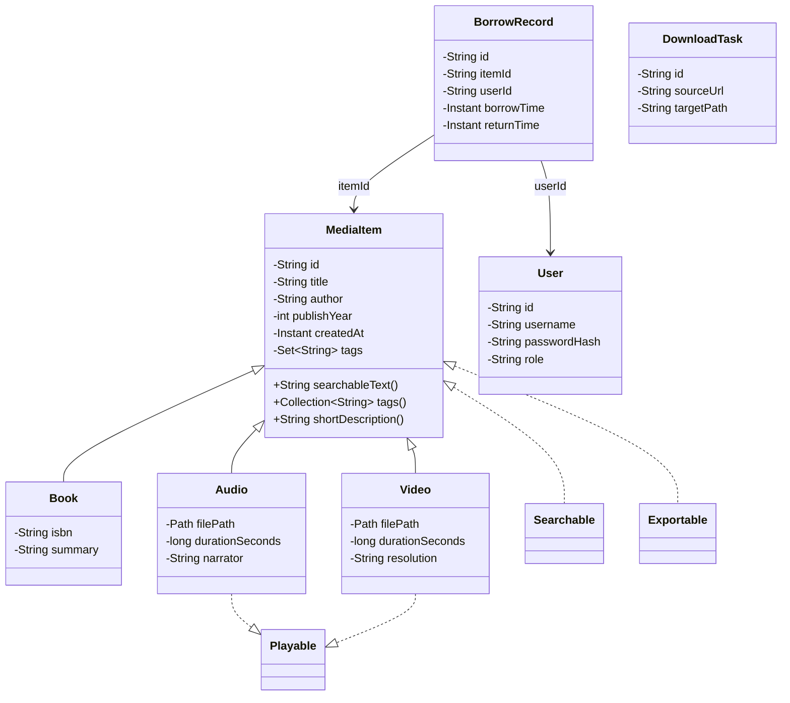

# 核心类图草图

```mermaid
classDiagram
    class MediaItem {
        -String id
        -String title
        -String author
        -int publishYear
        -Instant createdAt
        -Set~String~ tags
        +String searchableText()
        +Collection~String~ tags()
        +String shortDescription()
    }
    class Book {
        -String isbn
        -String summary
    }
    class Audio {
        -Path filePath
        -long durationSeconds
        -String narrator
    }
    class Video {
        -Path filePath
        -long durationSeconds
        -String resolution
    }
    class User {
        -String id
        -String username
        -String passwordHash
        -String role
    }
    class BorrowRecord {
        -String id
        -String itemId
        -String userId
        -Instant borrowTime
        -Instant returnTime
    }
    class DownloadTask {
        -String id
        -String sourceUrl
        -String targetPath
    }

    MediaItem <|-- Book
    MediaItem <|-- Audio
    MediaItem <|-- Video
    MediaItem <|.. Searchable
    MediaItem <|.. Exportable
    Audio ..|> Playable
    Video ..|> Playable
    BorrowRecord --> MediaItem : itemId
    BorrowRecord --> User : userId
```

> 使用 Mermaid 绘制类图，可粘贴至支持 Mermaid 的编辑器查看。
